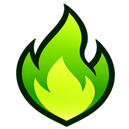

# greenflame



Yet another Windows screenshot tool, with very opinionated set of behaviors.  `¯\_(ツ)_/¯`

The selection scheme of [Greenshot](https://greenshot.org/)
, the editing scheme of [Flameshot](https://flameshot.org/) , all in one tool.

<br clear="left"/>

---

## Usage

**Run** `greenflame.exe`. The executable sits in the tray.

**Print Screen** or **right-click** the tray icon ➜  **Start capture** or **Exit**.

After **Start capture**, your screen is captured and you choose a region:

- **Click and drag** to select a rectangle (hold **Alt** to disable snapping).
- **Shift** + click ➜ select the whole monitor under the cursor.
- **Ctrl** + click ➜ select the window under the cursor.
- **Shift+Ctrl** + click ➜ select the whole screen.

**Drag the handles** on the selection to resize. Hold **Alt** to disable snapping.

- **Ctrl-S** ➜ save directly (no dialog) to the last-used folder as the configured format (default PNG), then close.
- **Ctrl-Shift-S** ➜ open **Save As** dialog, then save and close.
- **Ctrl-C** ➜ copy the selection to the clipboard, then close.
- **Escape** ➜ cancel or go back.

**Save As** supports **PNG**, **JPEG**, and **BMP**.

---

## Filename patterns

Saved files are named using configurable patterns with Greenshot-style `${VARIABLE}` placeholders. Each capture type has its own pattern, editable in `%APPDATA%\greenflame\greenflame.json` under the `"save"` section.

### Supported variables

| Variable | Expansion | Example |
|----------|-----------|---------|
| `${YYYY}` | 4-digit year | `2026` |
| `${YY}` | 2-digit year | `26` |
| `${MM}` | 2-digit month | `02` |
| `${DD}` | 2-digit day | `21` |
| `${hh}` | 2-digit hour (24h) | `14` |
| `${mm}` | 2-digit minute | `30` |
| `${ss}` | 2-digit second | `25` |
| `${title}` | Sanitized window title (max 50 chars, falls back to `window`) | `My_App` |
| `${monitor}` | 1-based monitor number | `2` |
| `${num}` | Incrementing counter (6-digit, zero-padded, next available by directory scan) | `000042` |

### Default patterns

| Capture type | Default pattern | Example output |
|---|---|---|
| Region | `${YYYY}-${MM}-${DD}_${hh}${mm}${ss}` | `2026-02-21_143025` |
| Desktop | `${YYYY}-${MM}-${DD}_${hh}${mm}${ss}` | `2026-02-21_143025` |
| Monitor | `${YYYY}-${MM}-${DD}_${hh}${mm}${ss}-monitor${monitor}` | `2026-02-21_143025-monitor2` |
| Window | `${YYYY}-${MM}-${DD}_${hh}${mm}${ss}-${title}` | `2026-02-21_143025-My_App` |

To customize, add the corresponding key to your config file:

```json
{
  "save": {
    "filename_pattern_region": "${YYYY}${MM}${DD}_${hh}${mm}${ss}",
    "filename_pattern_window": "Greenflame-${title}-${YYYY}${MM}${DD}"
  }
}
```

Only patterns you explicitly set are saved; omitted keys use the built-in defaults.

### Direct save format

The `default_save_format` setting controls which format **Ctrl-S** uses. Accepted values: `"png"` (default), `"jpg"`, `"bmp"`.

```json
{
  "save": {
    "default_save_format": "jpg"
  }
}
```

---

## Build

See [AGENTS.md](AGENTS.md) for toolchain and build steps.

---

**License** — [MIT](LICENSE)
