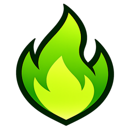

# greenflame



Yet another Windows screenshot tool, with very opinionated set of behaviors.  `¯\_(ツ)_/¯`

A selection scheme inspired by [Greenshot](https://greenshot.org/)
, an editing scheme inspired by [Flameshot](https://flameshot.org/) , all in one tool.

<br clear="left"/>

---

## Usage

**Run** `greenflame.exe`. The executable sits in the tray.

Press the **Print Screen** key, or **left-click** the tray icon to start an interactive capture. Alternatively, **right-click** the tray icon and choose a capture mode from the context menu.

In interactive mode, the screen is captured and a region is selected:

- **Click and drag** to select a rectangle (hold **Alt** to disable snapping).
- **Ctrl** + click ➜ select the window under the cursor.
- **Shift** + click ➜ select the whole monitor under the cursor.
- **Shift+Ctrl** + click ➜ select the whole desktop.

Once a region is selected:

- **Drag the handles** on the selection to resize (hold **Alt** to disable snapping).
- Hold **Tab** and drag inside the selection to **move** it (hold **Alt** to disable snapping).
- **Ctrl-S** ➜ save directly (no dialog) to the configured default save folder as the configured format (default PNG), then close.
- **Ctrl-Shift-S** ➜ open **Save As** dialog, then save and close.
- **Ctrl-Alt-S** ➜ save directly (no dialog), copy the saved file to the clipboard, then close.
- **Ctrl-Shift-Alt-S** ➜ open **Save As** dialog, save, copy the saved file to the clipboard, then close.
- **Ctrl-C** ➜ copy the selection to the clipboard, then close.
- **Escape** ➜ cancel or go back.

**Save As** supports **PNG**, **JPEG**, and **BMP**.

---

## Hotkeys

All hotkeys use the **Print Screen** key with modifier combinations. They are also available from the tray icon's right-click context menu.

| Hotkey | Action |
|--------|--------|
| **Prt Scrn** | Start interactive capture (select a region) |
| **Ctrl + Prt Scrn** | Copy the current window to the clipboard |
| **Shift + Prt Scrn** | Copy the current monitor to the clipboard |
| **Ctrl + Shift + Prt Scrn** | Copy the full desktop to the clipboard |
| **Alt + Prt Scrn** | Recapture the last captured region (same screen coordinates) |
| **Ctrl + Alt + Prt Scrn** | Recapture the last captured window (wherever it is now) |

The last two hotkeys require a previous capture in the current session. If no previous capture exists, or if the previously captured window has been closed or minimized, a warning toast is shown.

---

## Command-line mode

With no parameters, Greenflame starts normally in the tray.

You can also run one-shot capture commands (exactly one capture mode per invocation):

| Option | Meaning |
|---|---|
| `-r, --region <x,y,w,h>` | Capture an explicit physical-pixel region |
| `-w, --window <name>` | Capture a visible top-level window whose title matches `<name>` (case-insensitive contains) |
| `-m, --monitor <id>` | Capture monitor by 1-based id |
| `-d, --desktop` | Capture the full virtual desktop |
| `-h, --help` | Show help and exit |

Optional:

| Option | Meaning |
|---|---|
| `-o, --output <path>` | Output file path (valid only with a capture mode) |
| `-t, --format <png\|jpg\|jpeg\|bmp>` | Output format override |
| `-f, --overwrite` | Allow replacing an existing explicit `--output` file |

Both `--option=value` and `--option value` forms are supported.

Examples:

```bat
greenflame.exe --desktop
greenflame.exe --desktop --format jpeg
greenflame.exe --monitor 2 --output "D:\shots\monitor2.png"
greenflame.exe --window "Notepad" --output "D:\shots\note" --format jpg
greenflame.exe --window "Notepad" --output "D:\shots\note.jpg" --overwrite
greenflame.exe --window="Notepad" --output "D:\shots\note"
greenflame.exe --region 1200,100,800,600
```

**A note on output format resolution**

1. If `--output` has a supported extension (`.png`, `.jpg`, `.jpeg`, `.bmp`), that extension defines the format.
2. Otherwise, if `--format` is provided, `--format` defines the format.
3. Otherwise, `save.default_save_format` defines the format.
4. If `--output` extension conflicts with `--format`, the command fails.
5. If `--output` has an unsupported extension (for example `.tiff`), the command fails.
6. If `--output` has no extension, Greenflame appends one based on the resolved format.

### Exit codes

Greenflame uses these process exit codes for command-line invocations. Non-zero
codes are unique and not reused.

| Code | Meaning |
|---|---|
| `0` | Success (includes `--help` and "already running" tray startup) |
| `1` | Failed to register application window classes |
| `2` | CLI argument parse/validation failed |
| `3` | Failed to create tray window |
| `4` | Failed to enforce single-instance tray mode |
| `5` | `--region` capture requested but region data is missing |
| `6` | `--window` matched no visible window |
| `7` | `--window` matched multiple windows (ambiguous) |
| `8` | `--monitor` capture requested but no monitors are available |
| `9` | `--monitor` id is out of range |
| `10` | Output path resolution/reservation failed |
| `11` | Capture/save operation failed |
| `12` | Matched window became unavailable before capture |
| `13` | Matched window is minimized |

---

## Configuration

Greenflame reads `%APPDATA%\greenflame\greenflame.json`.

### All config keys

| Key | Type | Default | Meaning |
|---|---|---|---|
| `ui.show_balloons` | `boolean` | `true` | Show tray toast notifications after copy/save actions. |
| `save.default_save_dir` | `string` | `%USERPROFILE%\Pictures\greenflame` (runtime fallback when unset) | Folder used by **Ctrl-S**, **Ctrl-Alt-S**, and CLI captures when `--output` is not provided. |
| `save.last_save_as_dir` | `string` | Falls back to `save.default_save_dir`, then `%USERPROFILE%\Pictures\greenflame` | Initial folder used by **Ctrl-Shift-S** and **Ctrl-Shift-Alt-S** (Save As). |
| `save.default_save_format` | `string` | `"png"` | Default image format for **Ctrl-S**, **Ctrl-Alt-S**, and CLI output paths without explicit extension. Accepted values: `"png"`, `"jpg"`/`"jpeg"`, `"bmp"`. |
| `save.filename_pattern_region` | `string` | `screenshot-${YYYY}-${MM}-${DD}_${hh}${mm}${ss}` | Default filename pattern for region captures. |
| `save.filename_pattern_desktop` | `string` | `screenshot-${YYYY}-${MM}-${DD}_${hh}${mm}${ss}` | Default filename pattern for desktop captures. |
| `save.filename_pattern_monitor` | `string` | `screenshot-${YYYY}-${MM}-${DD}_${hh}${mm}${ss}-monitor${monitor}` | Default filename pattern for monitor captures. |
| `save.filename_pattern_window` | `string` | `screenshot-${YYYY}-${MM}-${DD}_${hh}${mm}${ss}-${title}` | Default filename pattern for window captures. |

Example:

```json
{
  "ui": {
    "show_balloons": true
  },
  "save": {
    "default_save_dir": "C:\\Users\\you\\Pictures\\greenflame",
    "last_save_as_dir": "D:\\shots\\scratch",
    "default_save_format": "png",
    "filename_pattern_region": "screenshot-${YYYY}-${MM}-${DD}_${hh}${mm}${ss}",
    "filename_pattern_desktop": "screenshot-${YYYY}-${MM}-${DD}_${hh}${mm}${ss}",
    "filename_pattern_monitor": "screenshot-${YYYY}-${MM}-${DD}_${hh}${mm}${ss}-monitor${monitor}",
    "filename_pattern_window": "screenshot-${YYYY}-${MM}-${DD}_${hh}${mm}${ss}-${title}"
  }
}
```

### Save filenames

Saved files use one pattern per capture type and Greenshot-style `${VARIABLE}` placeholders.

#### Filename patterns

##### Supported variables

| Variable | Expansion | Example |
|----------|-----------|---------|
| `${YYYY}` | 4-digit year | `2026` |
| `${YY}` | 2-digit year | `26` |
| `${MM}` | 2-digit month | `02` |
| `${DD}` | 2-digit day | `21` |
| `${hh}` | 2-digit hour (24h) | `14` |
| `${mm}` | 2-digit minute | `30` |
| `${ss}` | 2-digit second | `25` |
| `${title}` | Sanitized window title (spaces and invalid filename chars become `_`; max 50 chars; falls back to `window`) | `My_App` |
| `${monitor}` | 1-based monitor number | `2` |
| `${num}` | Incrementing counter (6-digit, zero-padded, next available by directory scan) | `000042` |

##### Default patterns

| Capture type | Default pattern | Example output |
|---|---|---|
| Region | `screenshot-${YYYY}-${MM}-${DD}_${hh}${mm}${ss}` | `screenshot-2026-02-21_143025` |
| Desktop | `screenshot-${YYYY}-${MM}-${DD}_${hh}${mm}${ss}` | `screenshot-2026-02-21_143025` |
| Monitor | `screenshot-${YYYY}-${MM}-${DD}_${hh}${mm}${ss}-monitor${monitor}` | `screenshot-2026-02-21_143025-monitor2` |
| Window | `screenshot-${YYYY}-${MM}-${DD}_${hh}${mm}${ss}-${title}` | `screenshot-2026-02-21_143025-My_App` |

---

## Build and test

- Build instructions: [docs/build.md](docs/build.md)
- Test instructions: [docs/testing.md](docs/testing.md)
- Agent-specific repository rules: [AGENTS.md](AGENTS.md)

---

**[MIT](LICENSE) License**
